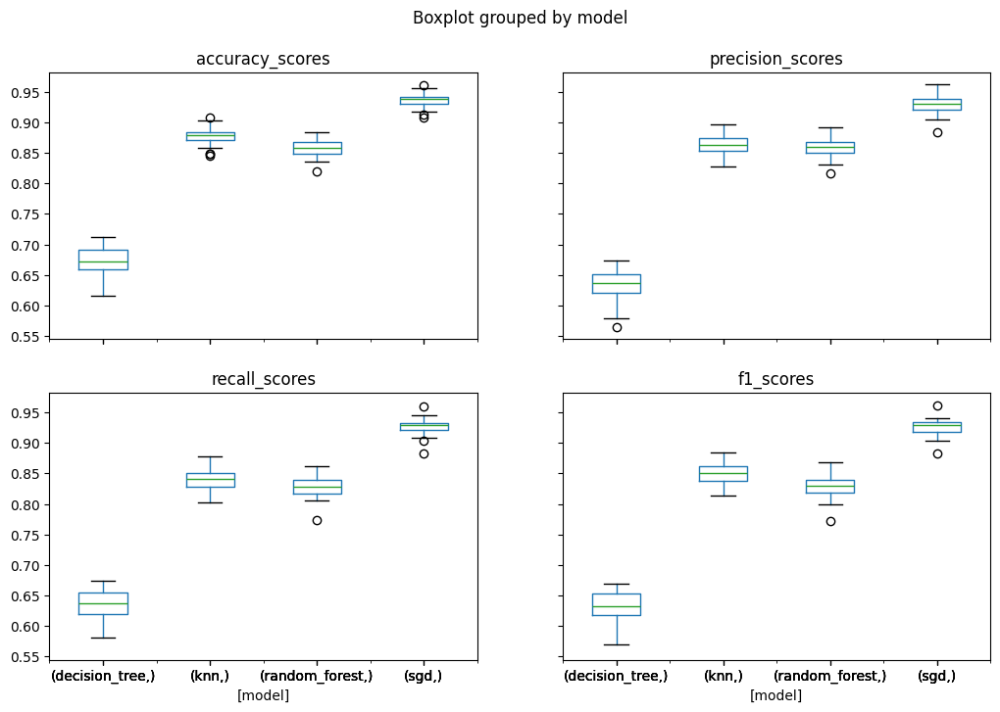
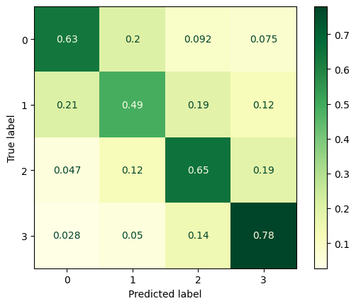
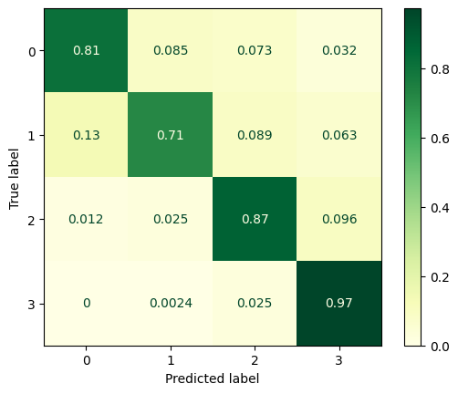
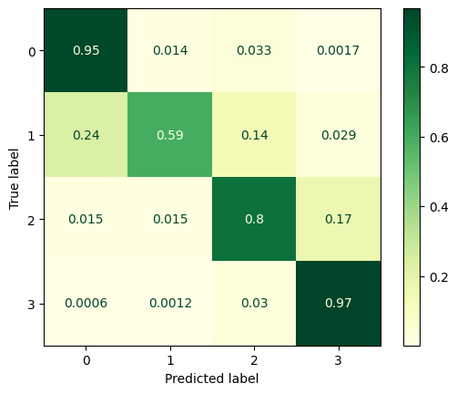
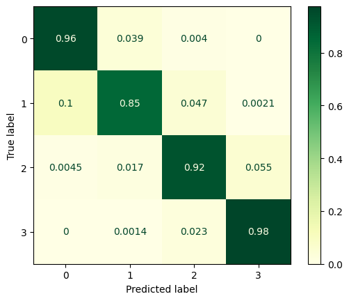
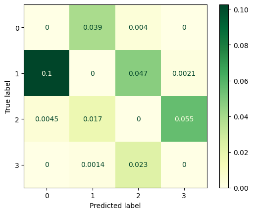

## Introdução

Este relatório apresenta o processo de desenvolvimento de um modelo de classificação textual que tem como objetivo identificar a dificuldade de um texto em português de acordo com as categorias: ensino fundamental I, ensino fundamental II, ensino médio e ensino superior. 

## Processo

A partir dos arquivos presentes no dataset, foi criado um único arquivo csv com os dados categorizados. Foram acrescentados a esses dados, outras estatísticas obtidas a partir da biblioteca spacy que podem vir a ser úteis.
Foram selecionados para uma investigação inicial as seguintes técnincas de classificação discutidas em [Kowsari et al. [2019]](https://doi.org/10.3390/info10040150) e [P. C. Sen et al. [2019]](https://doi.org/10.1007/978-981-13-7403-6_11):

- Random Forest Classifier (SVM)
- Stochastic Gradient Descent
- Decision Tree Classifier
- K Nearest Neighbors Classifier

Para cada técnica, foram feitas 30 execuções com sementes de randomização diferentes e foram computadas as métricas de acurácia, precisão, recall e f1-score, bem como as matrizes de confusão médias normalizadas. O comparativo dos resultados é apresentado a seguir.

Para visualizar o comportamento dos algoritmos de forma mais detalhada, foram geradas as matrizes de confusão médias normalizadas para cada técnica:

- Decision Tree Classifier

- K Nearest Neighbors Classifier

- Random Forest Classifier

- Stochastic Gradient Descent

É possível perceber que, de acordo com essas métricas, o modelo que apresentou melhor desempenho foi o SGD. 
Para melhor visualizar as categorias que apresentaram maior dificuldade de classificação, é apresentada a seguir a matriz de confusão do SGD com a diagonal principal zerada.

De acordo com o gráfico, o principal erro é classificar um texto do ensino fundamental II como sendo do ensino fundamental I. No entanto, nota-se que é uma tendência do modelo errar para categorias adjacentes.

- Resultados do experimento estão no arquivo Out_99.csv

  - Opções para melhorar o modelo:

      - Ver se está balanceado?
      - Remoção de outliers?
        - Como remover de dados multivariados?
      - Remoção de colunas?
        - Como ver quais colunas são mais relevantes?
      - Alteração de parâmetros?
      - x Uso de outras métricas? 
      - Tentar criar outras métricas?
        - Palavras incomuns aparecem no texto? (Conseguir dados de freq. de palavras em português)
      - Usar bag of words
        - Tentar lematizar com spacy e depois "reconstruir" o texto com os lemas
        - Aí fazer o count vectorizer e continuar do jeito que está sendo feito