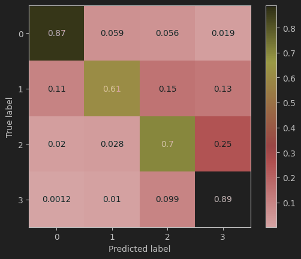

# Processo

- Criei um modelo de classificação usando o algoritmo Random Forest Classifier, com os parâmetros padrão do scikit-learn.
- Usei a biblioteca spacy para extrair características do textos, a principio utilizando as métricas de readability.
- Porém, foi obtida uma acurácia preliminar próxima de 0.5, indicando que a classificação é quase aleatória.
- Tendo estruturado o processo, o próximo passo foi acrescentar outras métricas da biblioteca spacy.
----------------
- Fiz um experimento com todas as métricas do spacy, obtendo uma acurácia média de 0.78 
- A matriz de confusão agregada e normalizada gerada no experimento é a seguinte:

- Resultados do experimento estão no arquivo Out_99.csv

  - Opções para melhorar o modelo:

      - Ver se está balanceado?
      - Remoção de outliers?
        - Como remover de dados multivariados?
      - Remoção de colunas?
        - Como ver quais colunas são mais relevantes?
      - Alteração de parâmetros?
      - x Uso de outras métricas? 
      - Tentar criar outras métricas?
        - Palavras incomuns aparecem no texto? (Conseguir dados de freq. de palavras em português)
      - Usar bag of words
        - Tentar lematizar com spacy e depois "reconstruir" o texto com os lemas
        - Aí fazer o count vectorizer e continuar do jeito que está sendo feito